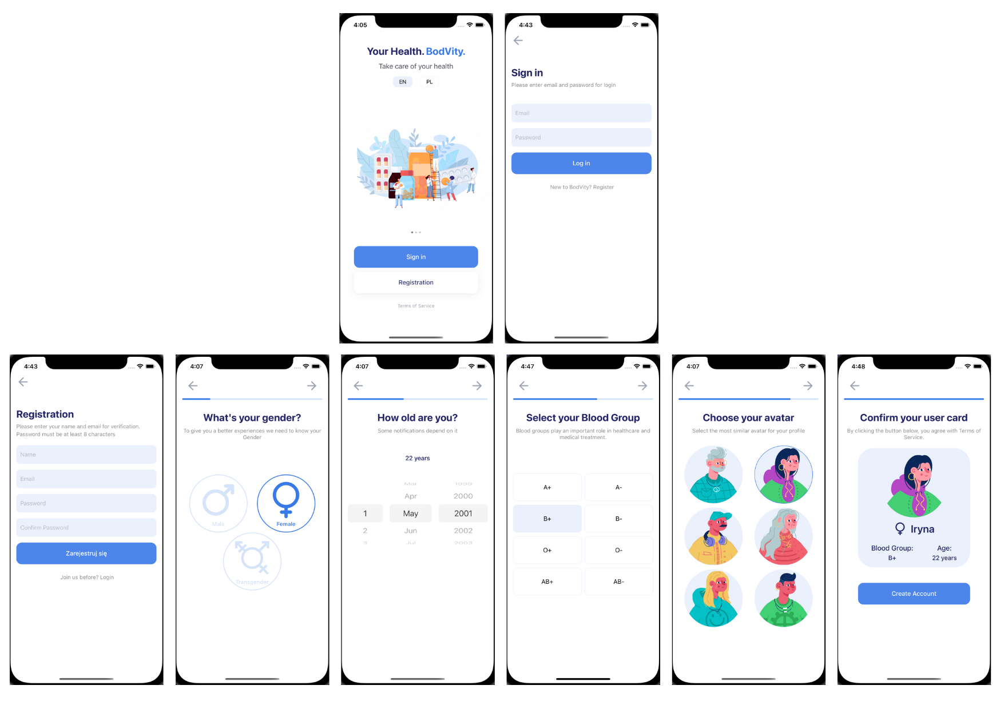
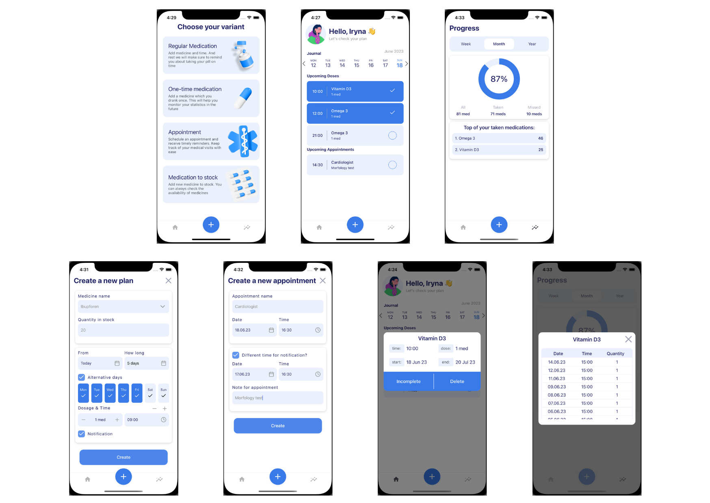
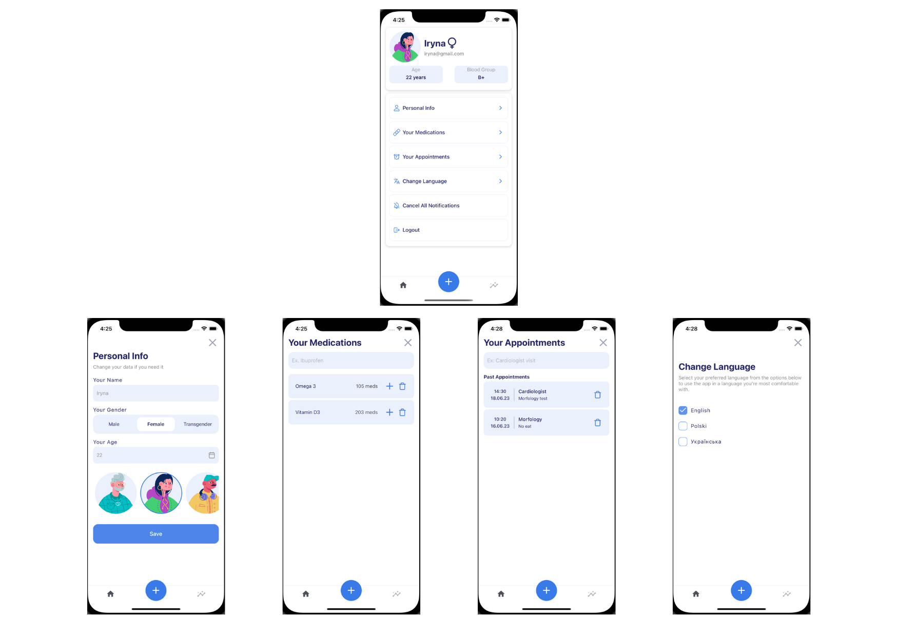

# BodVity

The app has been designed to support patients by providing them with reminders about taking their medication and doctor's appointments. The main purpose of the app is to provide patients with the necessary assistance to monitor their treatment and more fully control their health.

The main functionalities of the app are: creating a list of medicines with reminders for taking them, scheduling doctor's appointments and reminders for them. In addition, the app allows you to keep track of your stock of medicines and allows you to monitor statistics on used and unused medicines. It is worth noting that the app is cross-platform, allowing both iOS and Android users to use it on their mobile devices.

## Screenshots

#### Login and Registation

#### Features of app

#### Profile and settings

## Tech Stack

**Client:** React Native, Expo, i18next

**Server:** Firebase

